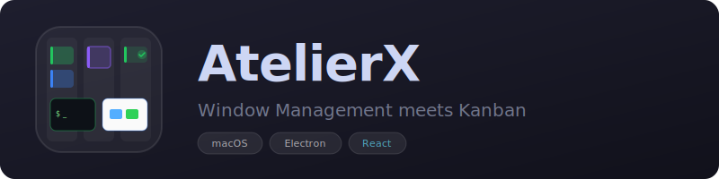

<p align="center">
  
</p>

<p align="center">
  <em>Atelier (workshop) + X (extension) &mdash; your creative workspace for window management</em>
</p>

<p align="center">
  
  
  
  
</p>

---

Terminal / Finder / 任意アプリのウィンドウをカンバンボードで管理するmacOSアプリ。プラグインで機能を拡張可能。

## Features

### Window Management
- **Kanban Board** &mdash; ウィンドウをカード化して「未着手」「実行中」「完了」で管理
- **Drag & Drop** &mdash; カードをカラム間で自由に移動
- **Window Jump** &mdash; カードクリックで対象ウィンドウを前面に表示
- **Tab Switching** &mdash; Terminal / Finder / カスタムアプリをタブで切り替え
- **Auto-Detect** &mdash; 未登録ウィンドウを自動検出して通知

### Grid Layout
- **Auto-Arrange** &mdash; ウィンドウをグリッド状に自動配置
- **Presets** &mdash; プラグインでカスタムレイアウトを追加可能
- **Multi-Display** &mdash; ディスプレイごとに配置先を選択

### Daily Report & Logging
- **Activity Log** &mdash; カードの移動・完了を自動記録
- **Export** &mdash; Markdown / JSON / テキスト / プラグインフォーマットで出力
- **Obsidian Integration** &mdash; デイリーノートに日報を直接差し込み

### Plugin System
- **GitHub Install** &mdash; `owner/repo` 形式でプラグインをインストール
- **Extensible API** &mdash; グリッドレイアウト、エクスポートフォーマット、カードアクション
- **Local Dev** &mdash; テンプレートからプラグインを開発・テスト

## Screenshot

```
┌─────────────┐ ┌─────────────┐ ┌─────────────┐
│    TODO      │ │ IN PROGRESS │ │    DONE      │
├─────────────┤ ├─────────────┤ ├─────────────┤
│ ▌Terminal    │ │ ▌Terminal    │ │ ▌Terminal  ✓ │
│  proj-api    │ │  proj-web   │ │  setup-ci    │
│              │ │  ▶ Jump     │ │              │
│ ▌Finder      │ │             │ │ ▌Finder    ✓ │
│  ~/docs      │ │             │ │  ~/assets    │
└─────────────┘ └─────────────┘ └─────────────┘
```

## Install

### macOS

1. [Releases](../../releases) ページから最新の `.dmg` をダウンロード
2. DMGを開いてApplicationsフォルダにドラッグ
3. Applicationsから起動

> アプリ内の設定画面からアップデートを確認できます。

## Tech Stack

| Layer | Technology |
|-------|-----------|
| Frontend | React 18 + TypeScript + Vite |
| Desktop | Electron |
| DnD | @dnd-kit |
| macOS API | AppleScript (Terminal / Finder / System Events) |

## Development

```bash
# Install dependencies
npm install

# Dev mode
npm run electron:dev

# Build (macOS)
npm run electron:build:mac
```

## Release

```bash
# Patch (0.9.0 -> 0.9.1)
npm run release:patch

# Minor (0.9.0 -> 0.10.0)
npm run release:minor

# Major (0.9.0 -> 1.0.0)
npm run release:major
```

Release script handles: version bump -> build -> commit -> tag -> push -> GitHub Release (DMG attached).

## Project Structure

```
├── electron/
│   ├── main.cjs            # Main process
│   ├── preload.cjs          # Preload script
│   ├── windowManager.cjs    # macOS window operations
│   ├── gridManager.cjs      # Grid arrangement
│   ├── pluginManager.cjs    # Plugin lifecycle
│   └── pluginAPI.cjs        # Plugin API
├── src/
│   ├── components/          # React components
│   ├── hooks/               # Custom hooks
│   ├── styles/              # CSS
│   └── types/               # TypeScript types
└── build/
    └── icon.icns            # App icon
```

## Plugin Development

See the [plugin development repository](../plugins/) for templates, tools, and documentation.

```bash
# Quick start
cp -r plugins/templates/basic my-plugin
# Edit manifest.json and main.js
./plugins/tools/install-local.sh my-plugin
```

## License

MIT
