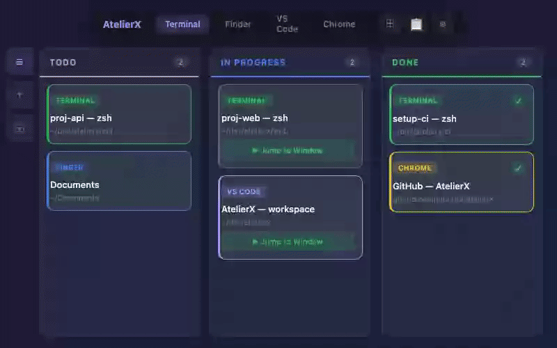
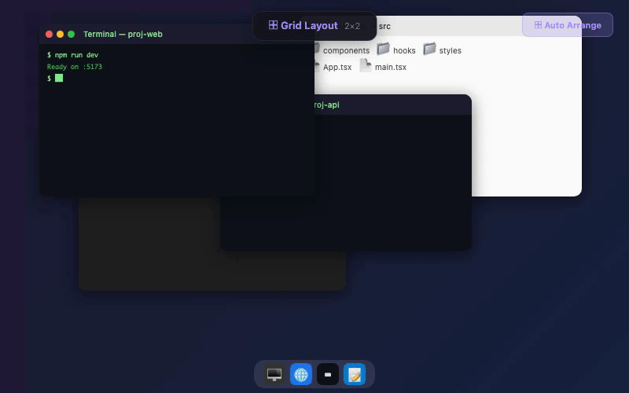

<p align="center">
  
</p>

<p align="center">
  <em>Atelier (workshop) + X (extension) &mdash; your creative workspace for window management</em>
</p>

<p align="center">
  
  
  
  
</p>

---

Terminal / Finder / 任意アプリのウィンドウをカンバンボードで管理するクロスプラットフォームアプリ。プラグインで機能を拡張可能。

## Features

### Window Management
- **Kanban Board** &mdash; ウィンドウをカード化して「未着手」「実行中」「完了」で管理
- **Drag & Drop** &mdash; カードをカラム間で自由に移動
- **Window Jump** &mdash; カードクリックで対象ウィンドウを前面に表示
- **Tab Switching** &mdash; Terminal / Finder / カスタムアプリをタブで切り替え
- **Auto-Detect** &mdash; 未登録ウィンドウを自動検出して通知

### Grid Layout
- **Auto-Arrange** &mdash; ウィンドウをグリッド状に自動配置
- **Multi-App Grid** &mdash; 画面を分割して異なるアプリのウィンドウを一括配置（実験的）
- **Sub-Grid** &mdash; 分割領域内のグリッド列×行を手動指定可能
- **Multi-Display** &mdash; ディスプレイごとに配置先を選択
- **Presets** &mdash; プラグインでカスタムレイアウトを追加可能

### Terminal Color (macOS)
- **Preset Themes** &mdash; Ocean / Forest / Sunset / Berry / Slate / Rose の6プリセット
- **Column Color** &mdash; カラムの色に応じてTerminal背景色を一括適用
- **Priority Color** &mdash; 優先順位に応じた色分け
- **Gradient** &mdash; 色相を均等分割したグラデーション
- **Auto Text Color** &mdash; 背景に応じてテキスト色を自動調整

### Daily Report & Logging
- **Activity Log** &mdash; カードの移動・完了を自動記録
- **Export** &mdash; Markdown / JSON / テキスト / プラグインフォーマットで出力
- **Obsidian Integration** &mdash; デイリーノートに日報を直接差し込み

### Plugin System
- **GitHub Install** &mdash; `owner/repo` 形式でプラグインをインストール
- **Extensible API** &mdash; グリッドレイアウト、エクスポートフォーマット、カードアクション
- **Local Dev** &mdash; テンプレートからプラグインを開発・テスト

## Demo

<p align="center">
  
</p>

### Drag & Drop

カードをカラム間でドラッグして、ウィンドウのステータスを管理。

<p align="center">
  
</p>

### Window Jump

カードの「Jump」ボタンで対象ウィンドウを即座に前面表示。

<p align="center">
  
</p>

### Grid Layout

散らばったウィンドウをワンクリックでグリッド状に自動配置。

<p align="center">
  
</p>

## Install

[Releases](../../releases) ページから最新版をダウンロード。

| Platform | Format | 手順 |
|----------|--------|------|
| **macOS** | `.dmg` | DMGを開いてApplicationsにドラッグ |
| **Windows** | `.exe` | インストーラーを実行 |
| **Linux** | `.AppImage` / `.deb` | `chmod +x` して実行、または `dpkg -i` |

> アプリ内の設定画面からアップデートを確認できます。

### Linux の前提条件

ウィンドウ管理機能を使うには:
```bash
sudo apt install wmctrl xdotool
```

## Tech Stack

| Layer | Technology |
|-------|-----------|
| Frontend | React 18 + TypeScript + Vite |
| Desktop | Electron 40 |
| DnD | @dnd-kit |
| macOS | AppleScript (Terminal / Finder / System Events) |
| Windows | PowerShell + user32.dll |
| Linux | wmctrl + xdotool (X11) |

## Development

```bash
# Install dependencies
npm install

# Dev mode
npm run electron:dev

# Build (macOS)
npm run electron:build:mac
```

## Release

```bash
# Patch (0.9.0 -> 0.9.1)
npm run release:patch

# Minor (0.9.0 -> 0.10.0)
npm run release:minor

# Major (0.9.0 -> 1.0.0)
npm run release:major
```

Release script handles: version bump -> build -> commit -> tag -> push -> GitHub Release (DMG attached).

## Project Structure

```
├── electron/
│   ├── main.cjs              # Main process
│   ├── preload.cjs            # Preload script
│   ├── pluginManager.cjs      # Plugin lifecycle
│   ├── pluginAPI.cjs          # Plugin API
│   └── platforms/             # Platform abstraction layer
│       ├── index.cjs          # Router (process.platform)
│       ├── darwin/            # macOS (AppleScript)
│       ├── win32/             # Windows (PowerShell)
│       └── linux/             # Linux (wmctrl/xdotool)
├── src/
│   ├── components/            # React components
│   ├── hooks/                 # Custom hooks
│   ├── styles/                # CSS
│   ├── utils/                 # Utilities
│   └── types/                 # TypeScript types
└── build/
    ├── icon.icns              # macOS icon
    ├── icon.ico               # Windows icon
    └── icon.png               # Linux icon
```

## Plugin Development

See the [plugin development repository](../plugins/) for templates, tools, and documentation.

```bash
# Quick start
cp -r plugins/templates/basic my-plugin
# Edit manifest.json and main.js
./plugins/tools/install-local.sh my-plugin
```

## License

MIT
